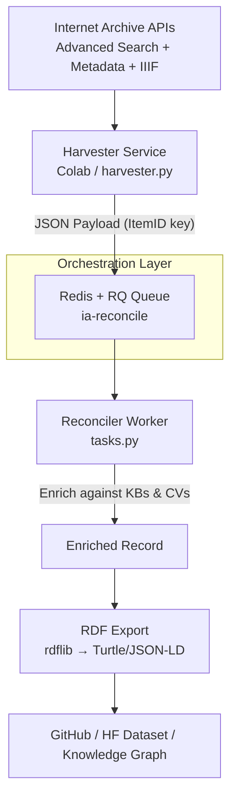

# Orchestrating-DCHD

**Internet Archive (archive.org) provides robust support for IIIF (International Image Interoperability Framework), a set of open standards for delivering and interacting with high-quality digital images, books, audio, video, and collections online.**

It enables deep zooming, side-by-side comparisons, annotations, region-specific cropping/citation, and interoperability with various IIIF-compatible viewers (e.g., Universal Viewer, Mirador).

### Key Features and History of IA's IIIF Service
- **Official Launch and Upgrade**: An experimental service started in 2015 on `iiif.archivelab.org`, making millions of books and images available. In September 2023, IA made IIIF official, moving to `iiif.archive.org`, upgrading to **IIIF 3.0** (Presentation and Image APIs), adding support for audio/video/collections, and improving reliability/resourcing.
- **Scope**: Nearly all image, text (books), audio, and video items on IA now support IIIF. It serves as both a consumer tool for existing items and a free digital asset management system for user uploads.

### How to Access IIIF on Internet Archive
1. **Find an Item's Identifier**: Go to an item's details page (e.g., `https://archive.org/details/[identifier]`).
2. **Manifest URL** (Presentation API — describes the object, metadata, structure, and links to images/media):
   - `https://iiif.archive.org/iiif/[identifier]/manifest.json` (defaults to latest, usually 3.0).
   - For collections: `https://iiif.archive.org/iiif/[collection_id]/collection.json` (with pagination for large ones).
3. **Image API** (for tiles, regions, resizing, rotation, etc.):
   - Example: `https://iiif.archive.org/image/iiif/[id+filename]/full/max/0/default.jpg`.
   - Info.json for viewer compatibility: `https://iiif.archive.org/iiif/[id]/info.json`.
4. **Helpers**: Visit `https://iiif.archive.org/iiif/helper/[id]` for media-type-specific links and info (images, books, A/V).

Legacy v2 manifests remain available for compatibility (e.g., via `/2/` paths or redirects during transition). The service runs on open-source code at [github.com/internetarchive/iiif](https://github.com/internetarchive/iiif).

### Uploading Content for IIIF
Everybody can upload images, zipped page sets (for books/texts), audio, or video. IA automatically generates derivatives and IIIF manifests. Best practices include using tiled formats like JPEG2000 or Pyramidal TIFF for optimal deep zoom. Provide metadata during upload for better discoverability.

### Metadata Services on Internet Archive
Separate from (but complementary to) IIIF, IA offers a **Metadata API (MDAPI)** for reading/writing item metadata.

- **Read API**: Fetch full metadata (title, description, subjects, creator, date, etc.) in JSON via `https://archive.org/metadata/[identifier]`. Fast and widely used.
- **Write API**: Update metadata (with permissions), including ad-hoc JSON. Supports safe, transactional changes.
- **Role with IIIF**: IIIF Presentation manifests pull from and include IA's item metadata (e.g., descriptive info, rights, sequences of canvases/pages). This makes IA items portable and richly annotated in IIIF viewers.

IA also has broader APIs for searching, downloading, and advanced metadata schemas.

### Use Cases and Benefits
- Scholars/researchers: Deep zoom, annotations, multi-institution comparisons.
- Institutions: Free hosting with IIIF interoperability.
- Developers: Embed in custom viewers or build on the GitHub repo.
- General users: Enhanced viewing of public domain or openly licensed materials.

For the latest docs, check [iiif.archive.org/iiif/documentation](https://iiif.archive.org/iiif/documentation) or the IIIF guide on [iiif.io](https://iiif.io/guides/guides/archive.org/).

IIF and metadata services make IA a powerful, open platform for cultural heritage preservation and access. 

**Internet Archive (IA) is one of the world's largest and most accessible repositories of digitized cultural heritage materials—books, images, manuscripts, audio, video, and ephemera—serving as a de facto structured data platform for Galleries, Libraries, Archives, and Museums (GLAM) worldwide.** Its IIIF and Metadata services transform raw digitized content into interoperable, machine-readable, and linkable data that powers research, digital humanities, exhibitions, and preservation. This makes IA uniquely positioned as a **Cultural Heritage Structured Data service**: it combines massive scale (tens of millions of items), open standards (IIIF 3.0 + JSON metadata), and free public APIs that enable bulk harvesting, enrichment, and integration into knowledge graphs or Linked Data ecosystems.

Your proposed architecture—**GitHub repo + Colab notebooks for advanced search → ItemID-keyed metadata + IIIF manifest retrieval → reconciliation pipeline against Knowledge Bases (KBs) and Controlled Vocabularies (CVs)**—is highly feasible, aligns perfectly with IA's design, and has precedents in digital humanities projects. It creates a reproducible, version-controlled, cloud-compute-friendly workflow for building enriched cultural heritage datasets.

### 1. IA's IIIF Service: Core Structured Data Engine for Cultural Heritage
Since September 2023, IA's IIIF service is **official and production-grade** (moved from experimental `iiif.archivelab.org` to `iiif.archive.org`). It supports **IIIF 3.0 Presentation and Image APIs** (with v2 backward compatibility via `/2/` paths or redirects). Nearly every image, text, audio, and video item—and collections—now exposes IIIF endpoints.

**Key capabilities relevant to structured data:**
- **Manifests (Presentation API)**: JSON-LD documents describing the object, its structure (canvases/pages/sequences), metadata, rights, and links to media. Example: `https://iiif.archive.org/iiif/[identifier]/manifest.json`. These are inherently structured and Linked-Data-ready (uses IIIF context for semantic interoperability).
- **Collections**: `https://iiif.archive.org/iiif/[collection_id]/collection.json` (with pagination: `/[page]/collection.json` for >1,000 items). Ideal for harvesting entire institutional or thematic subsets.
- **Image API + Helpers**: Deep-zoom, region extraction, etc. Helper endpoint `https://iiif.archive.org/iiif/helper/[id]` gives ready-to-use links for media types.
- **Audio/Video**: Full support for time-based media in manifests.
- **Interoperability**: Load IA manifests directly in Mirador, Universal Viewer, or any IIIF viewer for side-by-side comparison, annotation, and scholarly workflows—core to GLAM use cases.

**Cultural heritage impact**: IIIF was designed by and for GLAM institutions. IA's implementation lowers barriers: any researcher or small institution can upload and immediately get production-grade IIIF without running their own servers. It has been used by universities (e.g., Texas, Emory, McGill) and projects like BioStor for biodiversity research. Manifests embed descriptive metadata, enabling downstream Linked Data processing.

**GitHub source**: Fully open at `internetarchive/iiif` (Flask + Cantaloupe image server).

### 2. Metadata Services (MDAPI): The Structured Backbone
The **Item Metadata API** (`https://archive.org/metadata/[identifier]`) returns rich, structured JSON for every item. It acts as a "digital card catalog" and directly feeds IIIF manifests.

**Key features**:
- **Read API**: Full or partial JSON (e.g., `https://archive.org/metadata/[id]/metadata/title`). Includes Dublin Core-style fields: `title`, `creator`, `subject`, `date`, `description`, `rights`, `publisher`, `collection`, `mediatype`, plus IA-specific fields (e.g., `item_size`, `ocr`, `addeddate`). Supports slicing arrays for large file lists.
- **Structured & standards-aligned**: Metadata often maps to Dublin Core, MARC, or schema.org (visible in HTML pages). IIIF manifests pull from this, creating a unified structured view.
- **Write API** (authenticated): Transaction-safe updates via JSON patches—useful if your pipeline enriches and wants to contribute back (e.g., improved subjects).
- **Changes API**: `https://archive.org/services/docs/api/changes.html` – tracks item modifications by date. Perfect for incremental synchronization in your GitHub pipeline.
- **Other supporting APIs**: Views Data (usage stats), Simple Lists (relationships), OCR, PDF tools.

This makes IA metadata a high-quality source for cultural heritage Linked Data: you can harvest → enrich → publish as RDF or to Wikidata.

### 3. Search & Bulk Access: The Entry Point for Your Pipeline
- **Advanced Search API**: `https://archive.org/advancedsearch.php?q=[query]&fl[]=identifier&output=json&rows=100&page=N`. Returns JSON lists of items (identifiers + selected fields). Supports full query language (collections, subjects, dates, etc.). Limits apply (~10k sorted results), but you can iterate pages or use the "scraping API" for deeper paging.
- **Official Python library** (`internetarchive`): `pip install internetarchive`. Provides `search_items()`, `get_item()`, metadata fetching—ideal for Colab. Examples in docs and GitHub.

**Cultural heritage value**: You can target specific collections (e.g., `collection:library_of_congress` or public-domain books) to build focused datasets.

### 4. IA as a Cultural Heritage Structured Data Service: Strategic Role
IA democratizes GLAM data:
- **Scale + Openness**: Millions of public-domain and openly licensed items, contributed by libraries/archives globally.
- **Standards-First**: IIIF + JSON metadata = portable, interoperable structured data. Manifests are JSON-LD; metadata feeds semantic enrichment.
- **Interoperability Layer**: Enables cross-institution comparison, annotations, and integration into larger graphs (e.g., Europeana, DPLA, or custom KBs). Papers highlight IIIF's role in cultural heritage metadata aggregation and Linked Data.
- **Preservation + Access**: Free DAM (Digital Asset Management) for anyone—upload → auto-generate IIIF/metadata.
- **Limitations**: Not native RDF export (you transform via pipeline). Rate-limit politely for bulk work. Some items lack full manifests (rare edge cases).

IA fills a gap for unaffiliated researchers: "the average Internet user who may not benefit from... traditional research institutions."

### 5. Implementing Your GitHub + Colab Pipeline (Practical Blueprint)
This is an excellent, low-cost, reproducible setup. Here's a ready-to-adapt structure:

**Repo Layout** (on GitHub):
- `notebooks/`: Colab `.ipynb` files (search, fetch, reconcile).
- `data/raw/`: JSONL of IA results (ItemID as key).
- `data/enriched/`: Reconciled output (Parquet/JSONL + RDF if desired).
- `scripts/`: Python modules for pipeline.
- `requirements.txt`, `.github/workflows/` (CI for validation).

**Colab Notebook 1: Search & Sync**
```python
# pip install internetarchive requests pandas
from internetarchive import search_items
import json, requests, time

query = 'collection:some_cultural_heritage_collection AND mediatype:texts'
items = search_items(query, fields=['identifier', 'title', 'creator', 'date'])

data = []
for item in items.iter_as_items():
    item_id = item['identifier']
    # Fetch full metadata
    meta = requests.get(f'https://archive.org/metadata/{item_id}').json()
    # Fetch IIIF manifest
    manifest = requests.get(f'https://iiif.archive.org/iiif/{item_id}/manifest.json').json()
    combined = {'item_id': item_id, 'metadata': meta, 'iiif_manifest': manifest}
    data.append(combined)
    time.sleep(0.5)  # Be polite

# Save as JSONL to GitHub (or GDrive → GitHub sync)
with open('data/raw/items.jsonl', 'w') as f:
    for d in data: f.write(json.dumps(d) + '\n')
```

**Incremental Sync**: Use Changes API to poll for updates since last run.

**Colab Notebook 2: Reconciliation Pipeline**
- Load JSONL (ItemID key).
- Reconcile fields (e.g., `creator`, `subject`) against:
  - Wikidata / VIAF (use `wikibase` or `pywikibot`).
  - Controlled Vocabularies: Getty AAT, LCSH, GND via APIs or OpenRefine reconciliation service.
  - Tools: Python `reconcile` libs, fuzzy matching + entity linking (spaCy + Wikidata), or OpenRefine (export/import via Colab).
- Output: Enriched JSON + optional RDF (rdflib) for knowledge graph export.

**Best Practices**:
- Store only derived data (not full binaries) in GitHub.
- Use Git LFS for larger JSON files or switch to Hugging Face Datasets / Zenodo for releases.
- Authentication: Optional S3 keys for write or higher limits.
- Rate limits: IA is generous for research; monitor via Tasks API.
- Reproducibility: Pin notebook versions; use GitHub Actions for nightly syncs on subsets.
- Scale: Start with 1,000–10,000 items; parallelize with `concurrent.futures` or Dask in Colab Pro.

This pipeline turns IA into a living, enriched cultural heritage knowledge base—exactly the kind of structured data service GLAM researchers need.

**Excellent focus!** This setup turns your IA cultural heritage pipeline into a **modular, scalable, production-ready system**:

- **Harvester Service** (prototype in Colab → standalone script): Advanced search + metadata/IIIF fetch using ItemID as the canonical key.
- **Reconciliation Pipeline Service** (standalone worker): Enriches against Wikidata, Getty AAT, LCSH, or any Controlled Vocabulary (CV) via reconciliation APIs.
- **Orchestration**: Lightweight **message broker** using **Redis + RQ** (Redis Queue). It's the simplest, most reliable choice for Python data pipelines in digital humanities/research contexts—far easier than full Celery or Kafka for this scale, with excellent failure handling, retries, and monitoring.

This architecture is **completely decoupled**: the harvester only publishes tasks; the reconciler only consumes and enriches. You can run them on different machines (Colab → GitHub Codespaces → cloud VM → Docker Swarm). Data flows as compact JSON messages (ItemID + metadata + IIIF manifest URL). Results land in your GitHub repo (or a database/Hugging Face Dataset).

### Overall Architecture
```
[IA APIs] ←─── Harvester (Colab / harvester.py)
                 │
                 ▼ (enqueue JSON task)
          Redis + RQ Broker (queue: "ia-reconcile")
                 │
                 ▼ (consume & process)
          Reconciler Worker (reconciler/tasks.py + rq worker)
                 │
                 ▼ (enriched output)
          GitHub repo (data/enriched/) or S3 / HF Dataset
```

**Why RQ + Redis?**  
- Zero-config for small-to-medium cultural heritage batches (thousands of items).  
- Automatic retries, scheduling, and dashboard (`rq dashboard`).  
- Runs anywhere Python runs (local, Colab for testing, Docker, GitHub Actions).  
- Proven in DH/GLAM pipelines.

### Prerequisites (GitHub Repo Setup)
Create a repo like `ia-cultural-heritage-pipeline`. Folder structure:
```
Orchestrating-DCHD/
├── .env.example
├── .gitignore
├── README.md                  # (keep + enhance with diagrams)
├── requirements.txt
├── docker-compose.yml
├── Dockerfile.harvester
├── Dockerfile.reconciler
├── notebooks/
│   └── 01_ia_harvester_colab.ipynb
├── harvester/
│   └── harvester.py
├── reconciler/
│   ├── __init__.py
│   ├── tasks.py               # + RDF export
│   └── worker.py
├── data/
│   ├── raw/                   # .gitkeep
│   └── enriched/              # .gitkeep
├── docs/
│   └── architecture.md        # New: detailed docs + Mermaid
└── .github/workflows/
    └── harvest.yml            # Optional nightly CI
```

`requirements.txt`:
```txt
internetarchive
requests
pandas
rq
redis
python-dotenv
tqdm
```

### Starter Colab Notebook Template
Copy-paste the cells below into a new Colab notebook (`File → New notebook`). It includes:
- Interactive IA search + fetch (metadata + IIIF manifest).
- Local save **and** RQ enqueue mode (for interoperability).
- Built-in rate limiting and error handling.
- Ready to run in <5 minutes.

**Cell 1: Setup & Installation**
```python
# @title 1. Install & Configure
!pip install -q internetarchive rq redis pandas tqdm python-dotenv

import os
from dotenv import load_dotenv
import json
import time
from tqdm.notebook import tqdm
import pandas as pd
from internetarchive import search_items, get_item
import requests
from rq import Queue
from redis import Redis

load_dotenv()  # For .env with REDIS_URL if using external Redis

# === CONFIG ===
QUERY = 'collection:library_of_congress AND mediatype:texts AND year:1800-1900'  # ← Customize!
MAX_ITEMS = 50  # Start small for testing
OUTPUT_JSONL = 'data/raw/ia_items.jsonl'
REDIS_URL = os.getenv('REDIS_URL', 'redis://localhost:6379')  # Change for production
QUEUE_NAME = 'ia-reconcile'

# IA polite rate limit
RATE_LIMIT = 1.0  # seconds between calls

print("✅ Setup complete. Ready for search & harvest.")
```

**Cell 2: Harvester Core (Search → Fetch Metadata + IIIF)**
```python
# @title 2. Run Harvester
redis_conn = Redis.from_url(REDIS_URL)
q = Queue(QUEUE_NAME, connection=redis_conn)

items_data = []
search_results = search_items(QUERY, fields=['identifier', 'title', 'creator', 'date', 'subject'])

for item in tqdm(list(search_results.iter_as_items())[:MAX_ITEMS], desc="Harvesting IA items"):
    item_id = item['identifier']
    try:
        # 1. Full Metadata API
        meta_url = f"https://archive.org/metadata/{item_id}"
        meta = requests.get(meta_url, timeout=10).json()

        # 2. IIIF Manifest (latest 3.0)
        manifest_url = f"https://iiif.archive.org/iiif/{item_id}/manifest.json"
        manifest = requests.get(manifest_url, timeout=10).json()

        payload = {
            "item_id": item_id,
            "metadata": meta.get("metadata", {}),
            "files": meta.get("files", []),
            "iiif_manifest_url": manifest_url,
            "iiif_manifest": manifest,  # Full if small; else just URL in prod
            "harvested_at": time.strftime("%Y-%m-%dT%H:%M:%SZ", time.gmtime())
        }

        # Save locally (GitHub sync)
        with open(OUTPUT_JSONL, 'a') as f:
            f.write(json.dumps(payload) + '\n')

        # 3. Enqueue to Reconciler (interoperability!)
        job = q.enqueue('reconciler.tasks.reconcile_item', payload, job_timeout='10m')
        print(f"✅ Enqueued {item_id} → Job ID: {job.id}")

        items_data.append(payload)
        time.sleep(RATE_LIMIT)

    except Exception as e:
        print(f"⚠️ Error on {item_id}: {e}")
        continue

print(f"\n🎉 Harvest complete! {len(items_data)} items saved + enqueued.")
pd.DataFrame(items_data).head()
```

**Cell 3: Monitor & Utilities**
```python
# @title 3. Queue Status & Manual Re-run
print(f"Queue length: {q.count}")
# Example: Re-run a single ItemID manually
# payload = {...}  # from JSONL
# q.enqueue('reconciler.tasks.reconcile_item', payload)
```

### Standalone Services (Interoperability Layer)
Once the notebook works, copy logic into scripts for always-on operation.

**1. Harvester Service** (`harvester/harvester.py`)
```python
# Run with: python -m harvester.harvester --query "your query" --max 500
# Uses same code as notebook + argparse + cron/GitHub Actions support
# Can also use IA Changes API for incremental sync: https://be-api.us.archive.org/changes/v1
```

**2. Reconciliation Pipeline Service** (`reconciler/tasks.py`)
```python
# reconciler/tasks.py
from rq.decorators import job
import requests

@job('ia-reconcile', timeout='10m', result_ttl=3600)
def reconcile_item(payload: dict):
    item_id = payload['item_id']
    meta = payload['metadata']

    # Example: Reconcile key fields against Wikidata (cultural heritage standard)
    # Uses official Wikidata Reconciliation API (OpenRefine compatible)
    recon_url = "https://wikidata.reconci.link/en/api"  # or /fr etc. for language

    enriched = {"item_id": item_id, "reconciled": {}}

    for field in ['creator', 'subject', 'publisher']:
        if field in meta and meta[field]:
            value = meta[field] if isinstance(meta[field], str) else meta[field][0]
            # Reconciliation request (batch-friendly)
            recon_payload = {
                "queries": json.dumps({
                    "q0": {"query": value, "type": "/w/entity", "limit": 5}
                })
            }
            try:
                r = requests.post(recon_url, data=recon_payload, timeout=15)
                result = r.json().get("q0", {}).get("result", [])
                enriched["reconciled"][field] = result  # QID, label, score, etc.
            except:
                pass

    # Optional: Getty AAT / LCSH via their recon services
    # Export enriched JSONL + optional RDF (rdflib)

    # Save to GitHub (use gitpython or GitHub API) or push to data/enriched/
    with open(f"data/enriched/{item_id}.json", 'w') as f:
        json.dump(enriched, f, indent=2)

    return enriched
```

**3. Worker Entry** (`reconciler/worker.py`)
```python
from rq import Worker, Queue
from redis import Redis
import os

redis_conn = Redis.from_url(os.getenv('REDIS_URL'))
queues = [Queue('ia-reconcile', connection=redis_conn)]
worker = Worker(queues, connection=redis_conn)
worker.work(with_scheduler=True)  # Auto-retries + dashboard
```

**Run the services**:
```bash
# Terminal 1 (Redis)
docker run -p 6379:6379 redis:7

# Terminal 2 (Worker - standalone service)
cd reconciler
python worker.py

# Terminal 3 (Harvester - can be Colab or cron)
python -m harvester.harvester
```

**Dashboard**: `rq dashboard` (web UI to monitor jobs).

### How Interoperability Works (Message Payload)
Every task is a **self-contained JSON**:
```json
{
  "item_id": "example_id",
  "metadata": { ... full IA metadata ... },
  "iiif_manifest_url": "https://iiif.archive.org/iiif/example_id/manifest.json",
  "harvested_at": "2026-05-04T..."
}
```
- Reconciler fetches manifest on-demand if needed (avoids large messages).
- Results include Wikidata QIDs, Getty IDs, confidence scores → perfect for knowledge graph export.


    
### Scaling & Cultural Heritage Tips
- **Incremental sync**: Use IA Changes API (`be-api.us.archive.org/changes/v1`) in harvester for daily runs.
- **Controlled Vocabularies**: Extend `reconcile_item` with Getty AAT service (`https://services.getty.edu/vocab/reconcile/`).
- **OpenRefine integration**: Export JSONL → OpenRefine project for manual review (still the GLAM standard).
- **Deployment**: Docker Compose (Redis + 2 services) or GitHub Actions (nightly harvester).
- **Monitoring**: RQ built-in + Prometheus if you go big.

This is **immediately usable** and directly supports your deep-dive research paper (you can cite the repo + architecture diagram).  


